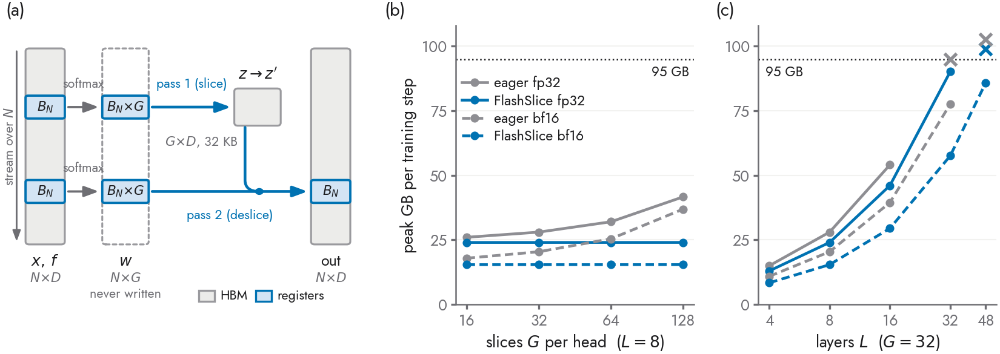
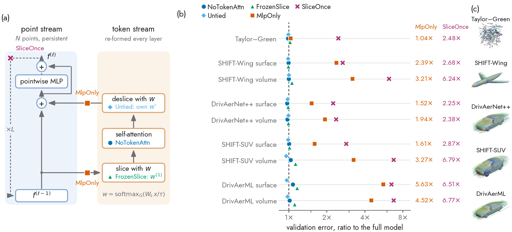
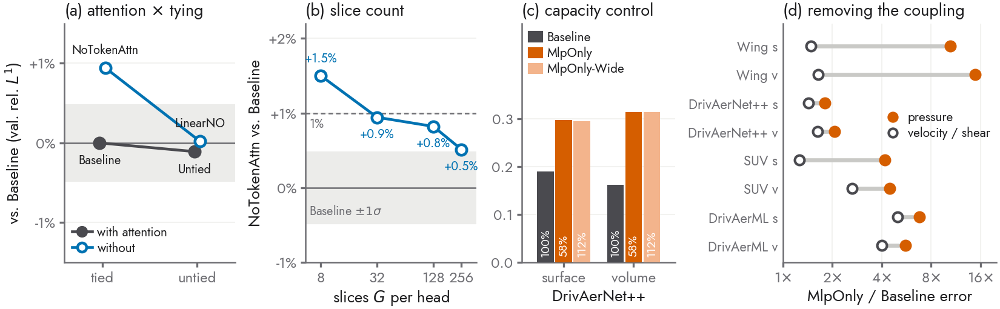

<div align="center">

# FlashSlice

**Fused Triton kernels for the slice/deslice coupling of physics-attention,
and the Transolver layer they accelerate.**

<!-- TODO at public release: replace the arXiv and PyPI placeholder badges, and switch the
     figure paths from assets/... to https://raw.githubusercontent.com/Shizheng-Wen/flashslice/main/assets/...
     so that they also render on PyPI (relative paths work on GitHub only). -->
[](#citation)
[](#installation)
[](https://github.com/Shizheng-Wen/flashslice/blob/main/LICENSE)
[](https://github.com/Shizheng-Wen/flashslice/blob/main/pyproject.toml)
[](https://pytorch.org)
[](https://github.com/triton-lang/triton)

</div>

FlashSlice is the companion code of **“Does Transolver really need a
Transformer?”**. The paper finds that Transolver's accuracy comes from the
slice/deslice coupling between a full-resolution point stream and a small set
of physics tokens, not from the self-attention among those tokens. This
repository provides the two things needed to use that result:

- **Kernels** that compute slice and deslice as two streaming passes over the
  points, without ever writing the `N × H × G` slice-weight tensor to memory.
  They reproduce eager PyTorch to within its own floating-point error, are
  bitwise deterministic, and train **1.35–1.7× faster in up to 25% less
  memory** at the standard configuration and **4–6.5× faster in 85–96% less
  memory** at large slice counts.
- **The Transolver model**, with every ablation of the paper available as a
  single flag.

It is not a training framework: there is no trainer, data pipeline or config
system, so the model and the kernels drop into an existing codebase.

## Contents

- [Installation](#installation)
- [Quick start](#quick-start)
- [How it works](#how-it-works)
- [Performance](#performance)
- [Numerical precision](#numerical-precision)
- [Supported shapes](#supported-shapes)
- [Ablations and results](#ablations-and-results)
- [Tests and benchmarks](#tests-and-benchmarks)
- [Citation](#citation)
- [License](#license)

## Installation

```bash
pip install flashslice                 # once released on PyPI
# or, from source
git clone https://github.com/Shizheng-Wen/flashslice.git
cd flashslice && pip install -e .
```

Requirements: Python ≥ 3.9, PyTorch ≥ 2.4, Triton ≥ 3.0 and an NVIDIA GPU.
Measurements were taken on two GPUs: an NVIDIA GH200 with PyTorch 2.5 and
Triton 3.0 (the paper's numbers), and an NVIDIA RTX 4090 with PyTorch 2.8
and Triton 3.4.

> **Supported GPUs.** Tile configurations are tuned per GPU class and
> picked automatically from the device's shared memory per block: a Hopper
> table (H100/GH200, swept on a GH200) and an Ada table (swept on an RTX 4090),
> which also serves other GPUs with less shared memory, such as consumer
> Ampere and the A100. `flashslice.kernels.tile_table()` reports the class in
> use; `set_tile_table(...)` or `FLASHSLICE_TILE_TABLE` forces one. The
> default `ieee` dot mode needs no tensor cores; `tf32`/`bf16` need Ampere or
> newer. For a new GPU, re-tune with `bench/bench_kernels.py` and
> `bench/pick_tiles.py`.

## Quick start

### The model

```python
import torch
from flashslice import Transolver

model = Transolver(
    space_dim=3, fun_dim=1, out_dim=4,   # coordinates, per-point inputs, outputs
    n_hidden=256, n_heads=8, n_layers=8,
    slice_num=32,                        # G, slices per head
    use_fused_slice=True,                # route slice/deslice through the kernels
).cuda()

x  = torch.randn(1, 200_000, 3, device="cuda")   # coordinates
fx = torch.randn(1, 200_000, 1, device="cuda")   # per-point inputs
y  = model(x, fx)                                # (1, 200000, 4)
```

`use_fused_slice` is an implementation switch, not a model change: outputs
match the eager path, and checkpoints are interchangeable in both directions.

### The kernels on their own

`x_mid` `(B, N, H, D)` is what the slice weights are computed from, `fx_mid`
`(B, N, H, DV)` is what is pooled, `W` is the slot projection, `b` a per-slot
bias (or `None`) and `tau` `(H,)` the temperature.

```python
from flashslice.kernels import fused_slice, fused_deslice

# slice, then deslice (Transolver's order); the deslice reuses the slice's statistics
z_num, s, stats = fused_slice(x_mid, fx_mid, W, b, tau, return_stats=True)
tokens = mix(z_num / (s + 1e-5)[..., None])                   # (B, H, G, DV)
out = fused_deslice(x_mid, W, b, tau, tokens, stats=stats)    # (B, N, H, DV)

# deslice, then slice (a persistent point stream)
out, stats = fused_deslice(x_mid, W, b, tau, tokens, return_stats=True)
z_num, s = fused_slice(x_mid, fx_mid, W, b, tau, stats=stats)
```

`W` may be shared `(G, D)`, per head `(H, G, D)` or per sample and head
`(B, H, G, D)` (e.g. `W = k(tokens)`); its gradient is returned in the same
shape, and `b` follows likewise. `DV` may differ from `D`.

## How it works



The eager layer materializes the slice weights `w` of shape `(B, H, N, G)` and
keeps them for the backward pass; for `N` in the millions this is the largest
activation of the layer and the only one that grows with `G`. FlashSlice
applies FlashAttention's trade to this pooling: each pass streams over the
points in tiles, forms the tile of `w` in registers, uses it and discards it,
and the backward pass recomputes it. The token state between the passes is
only `H × G × D` floats (32 KB at the standard configuration).

The kernels use no atomics, so two runs are bitwise identical, and they are
registered as PyTorch custom operators, so the model compiles into a single
`torch.compile` graph.

## Performance

One GH200, eager PyTorch against FlashSlice, no compilation or activation
checkpointing. Full model (`L=8`, `C=256`, `H=8`, `G=32`):

| | *N* | eager | FlashSlice | speedup | eager mem | FlashSlice mem | saved |
| --- | ---: | ---: | ---: | ---: | ---: | ---: | ---: |
| training, fp32 | 262k | 171 ms | 126 ms | **1.35×** | 28.0 GB | 24.0 GB | 14% |
| training, bf16 | 262k | 143 ms | 93.1 ms | **1.53×** | 20.4 GB | 15.4 GB | 24% |
| training, bf16 | 1M | 585 ms | 345 ms | **1.70×** | 81.3 GB | 61.3 GB | 25% |
| inference, fp32 | 8.4M | 1944 ms | 1160 ms | **1.68×** | 80.5 GB | 64.5 GB | 20% |
| inference, bf16 | 8.4M | 1420 ms | 932 ms | **1.52×** | 60.5 GB | 44.5 GB | 26% |
| inference, bf16 | 12.6M | OOM | 1411 ms | — | — | 66.7 GB | — |

One layer (`H=8`, `D=32`) at large slice counts, bf16 inputs and dots:

| | *G* | *N* | eager | FlashSlice | speedup | eager mem | FlashSlice mem | saved |
| --- | ---: | ---: | ---: | ---: | ---: | ---: | ---: | ---: |
| training | 256 | 262k | 47.5 ms | 11.9 ms | **3.98×** | 13.7 GB | 2.0 GB | 85% |
| training | 256 | 1M | 293.7 ms | 45.5 ms | **6.45×** | 54.5 GB | 8.1 GB | 85% |
| training | 512 | 262k | 90.6 ms | 20.0 ms | **4.53×** | 26.7 GB | 2.0 GB | 92% |
| training | 512 | 1M | OOM | 80.3 ms | — | — | 8.1 GB | — |
| training | 1024 | 262k | 180.2 ms | 37.6 ms | **4.79×** | 52.7 GB | 2.1 GB | 96% |
| inference | 256 | 4.2M | 157.3 ms | 53.2 ms | **2.95×** | 68.0 GB | 8.3 GB | 88% |

What changes most is how the layer scales:

- **Memory is flat in the slice count.** From `G=16` to `G=128` a bf16
  training step stays at 15.4 GB with FlashSlice, while eager grows from
  17.9 to 36.9 GB. One layer holds 2 GB whether `G` is 48 or 1024.
- **Depth reaches further.** Within 95 GB, FlashSlice trains 32 layers where
  eager fits 16 (fp32) and 48 where eager fits 32 (bf16).
- **It composes with the usual tools.** Against a `torch.compile`d eager
  baseline the kernels still train 1.24–1.26× faster; with activation
  checkpointing they are 1.31–1.42× faster; sharded over four GPUs they train
  16.8M points at 14.6M points/s, 2.6× the best achievable eager pipeline.

Sizing rule: fused memory scales with `B·N` and the number of layers, not with
`G` — about 8 GB per million points per layer for a bf16 training step and
2 GB per million for inference (`H=8`, `D=32`).

**On an RTX 4090** (24 GB, torch 2.8, Triton 3.4, the Ada tile table), one
layer (`H=8`, `D=32`), eager against FlashSlice in the same process:

| | *G* | *N* | eager | FlashSlice | speedup | eager mem | FlashSlice mem | saved |
| --- | ---: | ---: | ---: | ---: | ---: | ---: | ---: | ---: |
| training, fp32 | 32 | 262k | 66.1 ms | 16.5 ms | **4.01×** | 2.5 GB | 2.0 GB | 21% |
| training, bf16 | 32 | 1M | 115.7 ms | 38.9 ms | **2.97×** | 10.5 GB | 8.0 GB | 24% |
| training, fp32 | 64 | 262k | 80.3 ms | 18.1 ms | **4.45×** | 4.3 GB | 2.0 GB | 53% |
| training, bf16 | 256 | 262k | 135.0 ms | 15.1 ms | **8.96×** | 13.6 GB | 2.0 GB | 85% |
| training, bf16 | 1024 | 262k | OOM | 34.2 ms | — | — | 2.1 GB | — |
| inference, fp32 | 32 | 1M | 111.6 ms | 19.1 ms | **5.85×** | 5.0 GB | 4.0 GB | 20% |
| inference, bf16 | 256 | 1M | 99.2 ms | 13.1 ms | **7.56×** | 17.0 GB | 2.1 GB | 88% |

bf16 rows use `bf16` dots. The Hopper table does not transfer: several of its
tiles exceed the 4090's 99 KB of shared memory, and among those that fit, the
tuned table is up to 4.1× faster (G=64, fp32 training step: 18.1 against
74.2 ms). Every case of `bench/parity_test.py` passes on this GPU. Two checks
of `bench/parity_ops.py` do not: the temperature gradient of the blocked
kernels with per-sample weights, slice-first order, lands at 2.8–3.4×
eager's error against the 2× gate (relative error ~2×10⁻⁵), with either tile
table, so it is a numerics difference of this GPU and Triton version rather
than a tiling one.

<details>
<summary><b>Kernels as the coupling of another model</b></summary>

The v0.2.0 extensions (per-sample weights, a value width apart from the
logits width, one-pass statistics, an online deslice) came from using the
kernels as the coupling of a point-cloud model whose slots are anchor points
of each sample (`D=56`, `DV=32`, `H=8`, `N≈265k`, bf16 dots). One coupling
round, forward and backward, on one GH200:

| *G* | v0.1.0 | v0.2.0 | |
| ---: | ---: | ---: | ---: |
| 256 | 30.8 ms | 14.6 ms | **2.1×** |
| 1024 | 107 ms | 48.3 ms | **2.2×** |
| 2048 | 208 ms | 93.1 ms | **2.2×** |

In a 50k-step training run of that model, `bf16` dots tracked a `tf32`
control at every step at 3.5× less step time.

</details>

## Numerical precision

Inputs are fp32, or bf16 under `torch.autocast`; parameters stay fp32 and
accumulation is fp32 in every mode. The precision of the dots is chosen with
`set_dot_mode(...)` or the `FLASHSLICE_DOT_MODE` environment variable:

| mode | dots | error against fp64 | use it for |
| --- | --- | --- | --- |
| `ieee` (default) | fp32, on the FMA units | eager fp32's own | anything that must match eager |
| `tf32` | value dots on tf32 tensor cores | ~5×10⁻⁴ on outputs | fp32 inputs at large `G` |
| `bf16v` | value dots bf16, logits fp32 | between the two | bf16 inputs |
| `bf16` | all dots bf16 | eager bf16 autocast's own | bf16 training at large `G` |
| `tf32x3` | each dot as three tf32 products | 3–7× eager fp32's | fp32 inputs at large `G`, when `tf32` is too noisy |

The logits dot stays in fp32 below the `bf16` level because the softmax
Jacobian amplifies noise in the slice weights. Every mode is held to a parity
gate against an fp64 reference: the fused error on every output and parameter
gradient must stay within 1.25× of eager fp32's error (2× of eager bf16's for
the bf16 modes), and two fused runs must agree bitwise. The learned
temperature, whose gradient cancels row by row in exact arithmetic, is the
most sensitive quantity and the one the gate watches most closely.

## Supported shapes

Two kernel families sit behind `use_fused_slice`, and the layer picks one by
shape:

| family | shapes | how |
| --- | --- | --- |
| **single-tile** | `D`, `G` powers of two in `[16, 128]`, `DV = D` | the whole slot axis fits one tile, so the softmax over `G` never leaves registers; tiles tuned per `G` |
| **G-blocked** | any `G`, `D ≤ 256`, any `DV`, weights per head or per sample | one online pass saves the per-point softmax statistics `(m, l)` (2/`G` of `w`); every kernel then recomputes `w` one `G`-block at a time |

`D > 256` falls back to the eager path **visibly**: the layer logs a warning,
sets `use_fused_slice = False` on the model and records the reason in
`fused_slice_fallback`, so an inert flag can never silently train the
baseline. `set_kernel_mode("blocked")` forces the blocked family (for timing
and parity runs), and `set_block_g` overrides its block size.

## Ablations and results

Every variant of the paper is one flag on `Transolver`; at most one may be set
at a time.

| flag | what changes |
| --- | --- |
| `no_token_attention` | attention among the slice tokens becomes a per-token linear map; tokens no longer interact |
| `untie_slice_weights` | deslice gets its own projection and temperature |
| `share_slice_across_layers` | slice weights computed once at layer 1 and reused by every layer |
| `slice_once` | slice once → transformer on the `G` tokens → deslice once (no point stream) |
| `mlp_only` | the attention sublayer is removed entirely (pointwise model) |

`use_fused_slice` combines with every flag except `share_slice_across_layers`
and `slice_once`, which need the slice weights the kernels never materialize;
those combinations raise at construction.



Best validation relative L¹ on nine benchmarks in fluid dynamics and
industrial aerodynamics, with up to 1.3×10⁸ mesh points per sample.
Baseline and NoTokenAttn are mean ± std over three seeds, the others one
seed; **bold** marks the best per row.

| benchmark | Baseline | NoTokenAttn | MlpOnly | Untied | FrozenSlice | SliceOnce |
| --- | ---: | ---: | ---: | ---: | ---: | ---: |
| Taylor–Green | 0.0756 ±.0001 | **0.0745** ±.0001 | 0.0786 | 0.0755 | 0.0777 | 0.188 |
| SHIFT-Wing surface | 0.0580 ±.0005 | 0.0579 ±.0005 | 0.139 | **0.0576** | 0.0577 | 0.155 |
| SHIFT-Wing volume | **0.12708** ±.00068 | 0.12709 ±.00078 | 0.408 | 0.1280 | 0.1350 | 0.793 |
| DrivAerNet++ surface | 0.193 ±.005 | **0.188** ±.002 | 0.294 | 0.190 | 0.192 | 0.435 |
| DrivAerNet++ volume | 0.1625 ±.0003 | **0.159** ±.001 | 0.315 | 0.162 | 0.162 | 0.386 |
| SHIFT-SUV surface | 0.15654 ±.00074 | 0.15738 ±.00003 | 0.252 | **0.15575** | 0.15923 | 0.449 |
| SHIFT-SUV volume | 0.06010 ±.00056 | 0.06238 ±.00086 | 0.197 | **0.05773** | 0.06834 | 0.408 |
| DrivAerML surface | 0.089 ±.001 | 0.096 ±.000 | 0.501 | **0.086** | 0.104 | 0.579 |
| DrivAerML volume | 0.110 ±.005 | 0.112 ±.004 | 0.497 | **0.108** | 0.123 | 0.745 |

- **Token attention is removable.** NoTokenAttn is within −2.6% to +1.8% of
  the baseline on seven benchmarks and at +3.8% and +7.9% on the other two,
  and it is the best variant on three.
- **The coupling is not.** Removing it (MlpOnly) costs 1.04–5.6×, and
  widening the pointwise model to 112% of the baseline's parameters closes
  almost none of that gap.
- **Nor is the point stream.** SliceOnce keeps the attention and has more
  parameters than the baseline, but collapses the points into token space
  after one slice; it is the worst variant everywhere, at 2.2–6.8×.



The controls behind these readings: (a) whether the projections are tied or
untied does not interact with removing the attention; (b) NoTokenAttn stays
within 1.5% of the baseline for every slice count from 8 to 256; (c) a wider
pointwise model does not recover the coupling; (d) on every aerodynamic
benchmark, removing the coupling hurts the pressure, the globally determined
field, more than the velocity or wall shear beside it.

## Tests and benchmarks

```bash
pytest tests/                                            # dims contract, routing, visible fallback, eager equivalence
python bench/parity_test.py                              # the layer: fused vs eager, fp64-referenced, both families
python bench/parity_ops.py                               # the ops: weight layouts, value widths, both call orders
python bench/bench_layer.py --slices 256 --dtype bf16    # one layer, eager vs fused, any shape
python bench/bench_kernels.py --defaults-only            # per-kernel time, bandwidth, TFLOP/s
python bench/bench_kernels.py --family blocked --slices 256   # tile sweep for the blocked kernels
python bench/pick_tiles.py bench/results/sweep_*.json    # sweep results -> tile-table entry
```

`bench/README.md` lists what each script measures and the pitfalls that
matter when timing these kernels. Tag `v0.1.0` is the tree the paper's numbers
were measured on; [CHANGELOG.md](https://github.com/Shizheng-Wen/flashslice/blob/main/CHANGELOG.md) lists what `main` adds, and
[ROADMAP.md](https://github.com/Shizheng-Wen/flashslice/blob/main/ROADMAP.md) what comes next.

## Citation

If you use FlashSlice or build on its findings, please cite:

```bibtex
@inproceedings{flashslice2027,
  title     = {Does Transolver really need a Transformer?},
  author    = {TBA},
  booktitle = {Under review},
  year      = {2027},
  note      = {arXiv link to follow}
}
```

## License

Apache License 2.0; see [`LICENSE`](https://github.com/Shizheng-Wen/flashslice/blob/main/LICENSE).

The physics-attention layer, the MLP and the block structure derive from
[Transolver](https://github.com/thuml/Transolver) (Copyright © 2024 THUML @
Tsinghua University), used under the MIT License; those files carry a header
saying so, and [`NOTICE`](https://github.com/Shizheng-Wen/flashslice/blob/main/NOTICE) reproduces the MIT notice in full. The Triton
kernels, the ablation flags and the instrumentation are original work.
LinearNO (Hu et al., AAAI 2026), which the paper compares against, is not
included; see the authors' release at <https://github.com/HiPRL/LinearNO>.
