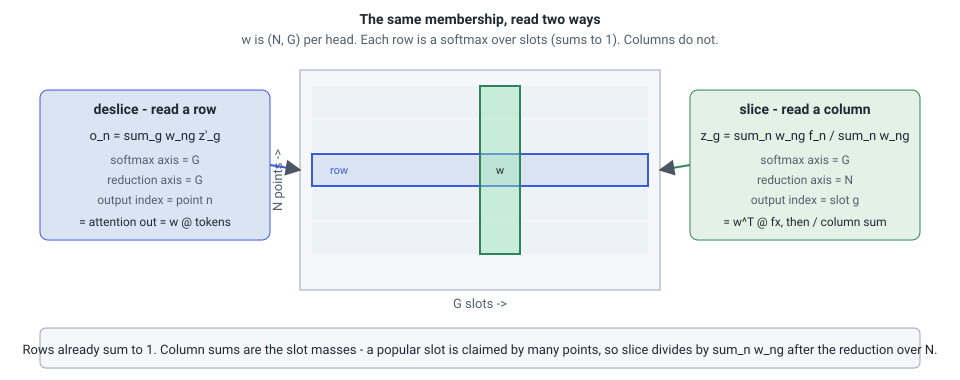

# The bottleneck

## Physics-attention in one layer

Transolver's layer takes the features of \(N\) mesh points, pools them onto a
small number \(G\) of *slices* (tokens), lets the tokens interact, and
broadcasts the result back to the points:

\[
w_{ng} = \operatorname{softmax}_g\!\left(\frac{x_n \cdot W_g + b_g}{\tau}\right),\qquad
z_g = \frac{\sum_n w_{ng}\, f_n}{\sum_n w_{ng}},\qquad
o_n = \sum_g w_{ng}\, z'_g ,
\]

per head. The first line is the *membership* \(w\) of every point in every
slice, a softmax over the slices; the second is the **slice** (a weighted
mean of the point features per token); the third is the **deslice** (the
same weights read the other way). \(z \to z'\) is whatever mixes the tokens:
self-attention in Transolver, a constant linear map in the paper's
`no_token_attention` variant, which loses nothing.

<figure markdown>

</figure>

## Where the memory goes

The eager implementation materializes \(w\), shape \((B, H, N, G)\), and keeps
it for the backward pass. For \(N\) in the millions this is the dominant
activation of the layer, and it is the only per-layer term that grows with
\(G\). Everything else in the layer is \(O(N \cdot \text{width})\). So the
eager layer's memory is linear in the slice count, and depth and slice count
compete for the same budget.

## Where the time goes

The paper's ablations ([What the paper found](paper.md)) show that the token
attention is optional and the coupling is not: the model with the attention
sublayer removed loses 1.04–5.6×, the model that slices once and never comes
back to the points is the worst variant everywhere. The load-bearing structure
is the alternation of pointwise MLPs at full resolution with the low-rank
bottleneck. It follows that the part worth making fast is slice/deslice.

Slice and deslice cost \(O(N G (D + D_V))\) multiply-adds each: \(N G D\) for
the logits and \(N G D_V\) for the values. At \(G=32\) that is comparable to
the pointwise MLPs; at \(G = 1024\) the coupling is most of the layer.

## FlashAttention's trade, applied here

FlashSlice never writes \(w\). It streams over the points (or the slots) in
tiles, forms the membership tile in registers, applies it, and moves on; in
the backward it recomputes the tile from what it saved, which is two floats
per point and head. That is exactly the trade FlashAttention makes for
softmax attention, applied to a pooling that is not attention: the "query" is
a point, the "keys" are the \(G\) slot projections, and the softmax runs over
the slots.

Two things differ from attention and shape the kernels:

- **The slice is the transpose of the deslice.** Deslice accumulates per point
  over slots, which is attention's shape, and an online softmax over the
  streamed axis works. Slice accumulates per *slot* over points, so the
  accumulator is indexed by the axis the softmax does not run over, and the
  normalizer for each point must be known before its contributions are added
  up. This is why the blocked kernels save per-point statistics the way
  FlashAttention's backward saves the log-sum-exp, and why the slot-owning
  kernels stream over points with those statistics in hand.
- **A temperature gradient.** \(\tau\) is learned, and its gradient is a sum
  over every \((n, g)\) pair of \(dl_{ng} \cdot (-\text{logit}_{ng} / \tau)\)
  where \(\sum_g dl_{ng} = 0\) on every row in exact arithmetic. It is the
  most rounding-sensitive quantity in the layer and the canary of the parity
  gate ([Numerics](numerics.md)).

The result is an implementation switch: outputs match the eager path, the
membership is never formed, memory is flat in \(G\), and the layer's cost is
the dot throughput of the coupling itself.
