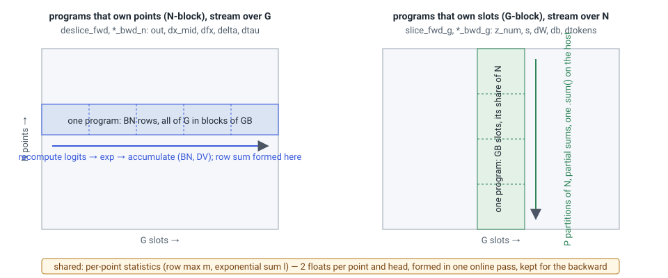
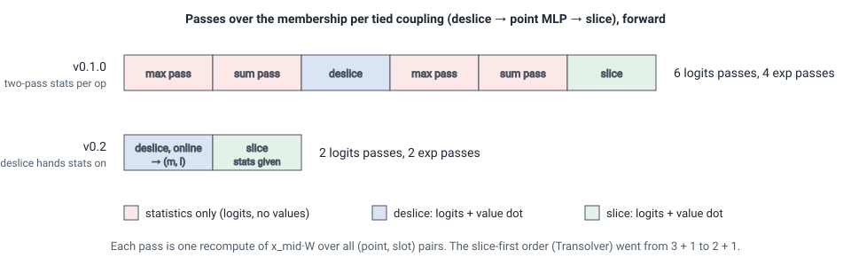

# The kernels

Two families sit behind `fused_slice` and `fused_deslice`, chosen by shape
([Shapes and routing](shapes.md)). Both are Triton kernels registered as
`torch.library` custom ops: opaque to `torch.compile`, autograd-registered,
with fake implementations for tracing.

## Single-tile kernels

`flashslice/kernels/slice_ops.py`. Each program owns a block of `BLOCK_N`
points and holds the *whole* slot axis \(G\) and head width \(D\) in one tile,
so the softmax over slots is register-local: max, exponentials and the
normalizer never leave the tile. Four kernels — slice forward, deslice
forward, slice backward, deslice backward — with tile configurations tuned per
\(G\) (using the \(G = 32\) table at \(G = 128\) costs up to 40–80× through
register spilling). They serve \(D\) and \(G\) that are powers of two in
\([16, 128]\) with equal value width, which is every shape the paper reports,
and they are the measured, frozen path. The slot-owning quantities of the
slice (\(z\), \(s\), \(dW\), \(db\)) come from per-program partial sums
reduced on the host with one `.sum()`: no atomics.

## G-blocked kernels

`flashslice/kernels/blocked.py`. Any \(G \ge 1\) (the last block is masked),
any \(D\) and \(D_V\) up to 256 (padded to a power of two), weights per head or
per sample. They take the approach of FlashAttention's *backward* rather than
its forward.

<figure markdown>

</figure>

**Ownership.** Quantities indexed by a point — the deslice output, \(dx_{mid}\),
\(df\), the Jacobian term \(\delta_n\), the temperature gradient — come from
programs that own an \(N\)-block and stream over \(G\) in blocks of `GB`.
Quantities indexed by a slot — the tokens \(z\), \(s\), \(dW\), \(db\), the
token gradient — come from programs that own a \(G\)-block and stream over
their partition of the points, writing per-program partials that the host
reduces with one deterministic `.sum()`. Nothing is ever normalized across
blocks in registers: there is no running accumulator to rescale except in the
two kernels that own points and have no statistics yet (below).

**Statistics.** A small pass forms, per point and head, the row max
\(m_n\) and the sum of exponentials \(l_n\) of the slot logits — two floats,
\(2/G\) of the tensor the eager path stores — in one online pass over the
slots. Every other kernel recomputes \(w_{ng} = \exp(\text{logit}_{ng} - m_n) /
l_n\) one block at a time. The statistics are kept for the backward. The
backward kernels that own points form the row sum they normalize with
themselves, from the exponentials they use, for the reason given in
[Numerics](numerics.md#the-canary-the-temperature-gradient); the forward
and the slot-owning kernels take the saved \(l\).

**The online deslice.** A deslice with no statistics in hand does not run the
statistics pass first: it runs FlashAttention's forward, rescaling its
accumulator and row sum whenever the row max moves, and stores the \((m, l)\)
it ends with. Handed to a slice over the same membership
(`fused_slice(..., stats=)`), that slice skips its own statistics pass. A tied
coupling therefore pays for the membership once per op in either order:

<figure markdown>

</figure>

**Backward.** Each op's backward is two kernels. The point-owning kernel makes
two passes over the slots: the first forms \(df\) (slice) or nothing (deslice)
together with the Jacobian numerator \(\sum_g e_{ng}\, dw_{ng}\) and the row
sum, all unnormalized and scaled once; the second forms \(dx_{mid}\) and the
temperature gradient from \(dl_{ng} = (e_{ng}\, dw_{ng} - e_{ng}\, \delta_n) / l_n\),
built from the same products. The slot-owning kernel makes one pass over its
points for \(dW\), \(db\) and, for the deslice, the token gradient. Three
logits recomputes per op; the single-tile kernels need one.

**Cost against the single-tile path** at a shape both can serve: the
statistics pass (none when a deslice runs first), one more logits recompute in
each backward, and the slot-owning kernels re-reading their inputs once per
block. The block index is the fastest grid axis, so consecutive programs
stream the same rows and the re-reads mostly resolve in L2. That is why
routing prefers the single-tile kernels wherever they apply.

## Dot precision inside a kernel

Every kernel takes a `DOT` level. The logits dot is `ieee` fp32 unless the
level is `bf16` (all dots in bf16 on tensor cores) or `tf32x3` (three tf32
products); the value dots follow the level. Accumulation is fp32 throughout,
loads convert to fp32, and bf16 inputs are cast back to bf16 only at the dot.
The `ieee` dot is Triton's FMA path — about 15 TFLOP/s on a GH200 — so the
blocked kernels at large \(G\) are compute-bound in the default mode and need
a tensor-core mode to pull ahead of eager ([Performance](../performance.md)).

## What a program does per element

For one \((n, g)\) pair and head, a forward pass does one logits multiply-add
chain of length \(D\), one exponential, one value multiply-add chain of length
\(D_V\), and a handful of fp32 operations: the temperature (a multiply by a
reciprocal formed once per program), the shift by \(m_n\), the mask where the
last block is padded. Divisions are gone from the inner loops: the row
normalizer is applied once per row after the loop in the point-owning
kernels, and as a per-row reciprocal per tile in the slot-owning ones. At
\(D + D_V \approx 90\) the exponential is the second cost after the dots, the
same limit FlashAttention-3 meets at small head dimensions.
