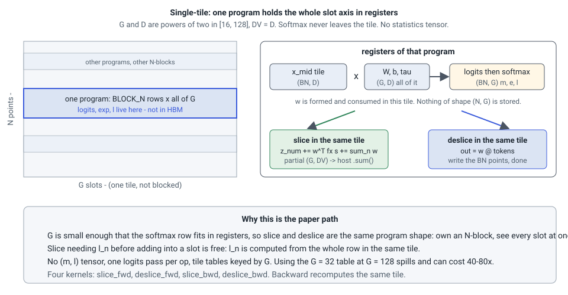
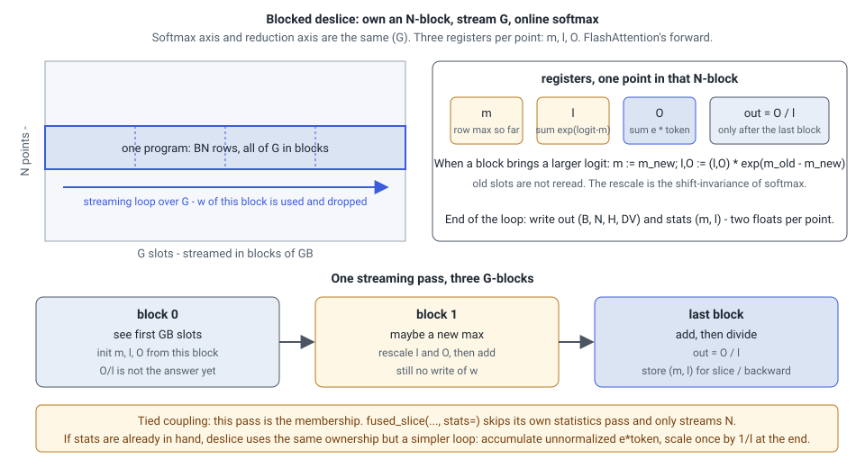
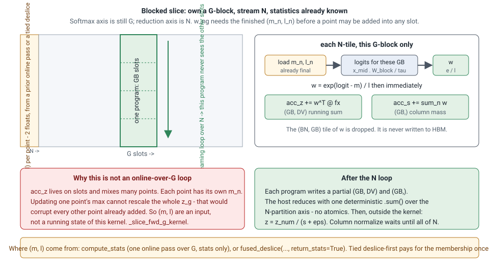

# The kernels

Two families sit behind `fused_slice` and `fused_deslice`, chosen by shape
([Shapes and routing](shapes.md)). Both are Triton kernels registered as
`torch.library` custom ops: opaque to `torch.compile`, autograd-registered,
with fake implementations for tracing.

## Single-tile kernels

`flashslice/kernels/slice_ops.py`. Each program owns a block of `BLOCK_N`
points and holds the *whole* slot axis \(G\) and head width \(D\) in one tile,
so the softmax over slots is register-local: max, exponentials and the
normalizer never leave the tile.

<figure markdown>

</figure>

Four kernels — slice forward, deslice forward, slice backward, deslice
backward — with tile configurations tuned per \(G\) (using the \(G = 32\)
table at \(G = 128\) costs up to 40–80× through register spilling). They
serve \(D\) and \(G\) that are powers of two in \([16, 128]\) with equal
value width, which is every shape the paper reports, and they are the
measured, frozen path. The slot-owning quantities of the slice (\(z\),
\(s\), \(dW\), \(db\)) come from per-program partial sums reduced on the
host with one `.sum()`: no atomics. There is no statistics tensor: \(l_n\)
is computed from the whole row in the same tile, so slice's "need the row
normalizer before adding into a slot" is free.

## G-blocked kernels

`flashslice/kernels/blocked.py`. Any \(G \ge 1\) (the last block is masked),
any \(D\) and \(D_V\) up to 256 (padded to a power of two), weights per head or
per sample. They take the approach of FlashAttention's *backward* rather than
its forward.

<figure markdown>

</figure>

**Ownership.** Quantities indexed by a point — the deslice output, \(dx_{mid}\),
\(df\), the Jacobian term \(\delta_n\), the temperature gradient — come from
programs that own an \(N\)-block and stream over \(G\) in blocks of `GB`.
Quantities indexed by a slot — the tokens \(z\), \(s\), \(dW\), \(db\), the
token gradient — come from programs that own a \(G\)-block and stream over
their partition of the points, writing per-program partials that the host
reduces with one deterministic `.sum()`. Nothing is ever normalized across
blocks in registers: there is no running accumulator to rescale except in the
two kernels that own points and have no statistics yet (below).

**Statistics.** A small pass forms, per point and head, the row max
\(m_n\) and the sum of exponentials \(l_n\) of the slot logits — two floats,
\(2/G\) of the tensor the eager path stores — in one online pass over the
slots. Every other kernel recomputes \(w_{ng} = \exp(\text{logit}_{ng} - m_n) /
l_n\) one block at a time. The statistics are kept for the backward.

**The online deslice.** A deslice with no statistics in hand does not run the
statistics pass first: it runs FlashAttention's forward. Softmax axis and
reduction axis are the same (\(G\)), so three registers per point — the
running max \(m\), the shifted sum \(l\), the unnormalized output \(O\) —
are enough. A new G-block that raises the max rescales \(l\) and \(O\) by
\(\exp(m_{\mathrm{old}}-m_{\mathrm{new}})\); old slots are not reread. The
pass ends with \(\mathrm{out}=O/l\) and writes \((m,l)\).

<figure markdown>

</figure>

Handed to a slice over the same membership (`fused_slice(..., stats=)`),
those statistics skip the slice's own statistics pass. A tied coupling
therefore pays for the membership once per op in either order:

**Blocked slice.** Slice cannot do that loop. Its accumulators \(z_g\),
\(s_g\) live on slots and mix many points; each point has its own \(m_n\).
Updating one point's max cannot rescale a shared \(z_g\). So \((m,l)\) are
an *input*. Programs own a G-block and stream over \(N\): for each N-tile
they load the finished statistics, recompute \(w\) for those slots only,
add \(w^{\top} fx\) into the running \(z,s\), and drop the tile. Partials
are reduced on the host; column normalization \(z = z_{\mathrm{num}}/(s+\varepsilon)\)
waits until all of \(N\).

<figure markdown>

</figure>

A tied coupling in either order therefore looks like this — the membership
is paid once per op, not once per statistics pass plus once per apply:

<figure markdown>

</figure>

**Backward.** Each op's backward is two kernels. The point-owning kernel makes
two passes over the slots: the first forms \(df\) (slice) or nothing (deslice)
together with the Jacobian numerator \(\sum_g e_{ng}\, dw_{ng}\) and the row
sum, all unnormalized and scaled once; the second forms \(dx_{mid}\) and the
temperature gradient from \(dl_{ng} = (e_{ng}\, dw_{ng} - e_{ng}\, \delta_n) / l_n\),
built from the same products. The slot-owning kernel makes one pass over its
points for \(dW\), \(db\) and, for the deslice, the token gradient. Three
logits recomputes per op; the single-tile kernels need one.

**Cost against the single-tile path** at a shape both can serve: the
statistics pass (none when a deslice runs first), one more logits recompute in
each backward, and the slot-owning kernels re-reading their inputs once per
block. The block index is the fastest grid axis, so consecutive programs
stream the same rows and the re-reads mostly resolve in L2. That is why
routing prefers the single-tile kernels wherever they apply.

## Dot precision inside a kernel

Every kernel takes a `DOT` level. The logits dot is `ieee` fp32 unless the
level is `bf16` (all dots in bf16 on tensor cores) or `tf32x3` (three tf32
products); the value dots follow the level. Accumulation is fp32 throughout,
loads convert to fp32, and bf16 inputs are cast back to bf16 only at the dot.
The `ieee` dot is Triton's FMA path — about 15 TFLOP/s on a GH200 — so the
blocked kernels at large \(G\) are compute-bound in the default mode and need
a tensor-core mode to pull ahead of eager ([Performance](../performance.md)).

## What a program does per element

For one \((n, g)\) pair and head, a forward pass does one logits multiply-add
chain of length \(D\), one exponential, one value multiply-add chain of length
\(D_V\), and a handful of fp32 operations: the shift by \(m_n\), the mask
where the last block is padded, and the factors \(1/\tau\) and \(1/l_n\).
Where and how those are applied was settled by measurement, because Triton
3.0 makes two things expensive on the FMA paths and one thing wrong. Wrong:
Triton's `/` is the approximate `div.full`, and applied to the logits its
bias put 8–14× eager's error on the temperature gradient. Expensive: a
broadcast multiply on the (BN, GB) tile that feeds a transposed FMA dot, or
a scaling of that dot's other operand, changed the layout Triton gave the
tile and cost the dot its vectorized operand, 6–60×. So on the FMA paths the
temperature goes, as a correctly rounded reciprocal, onto the operand of the
logits dot that a program loads once (\(x_{mid}\) in the kernels that own
points, the weight block in the kernels that own slots); the kernels that
own points normalize with correctly rounded reciprocals applied to `dl` and
to the accumulators; and the kernels that own slots divide their tile by
\(l_n\) and \(\tau\) with Triton's division, whose per-row bias the gradients
they produce absorb as a relative perturbation. On the tensor-core paths the
tile simply multiplies the reciprocals. At
\(D + D_V \approx 90\) the exponential is the second cost after the dots, the
same limit FlashAttention-3 meets at small head dimensions.
