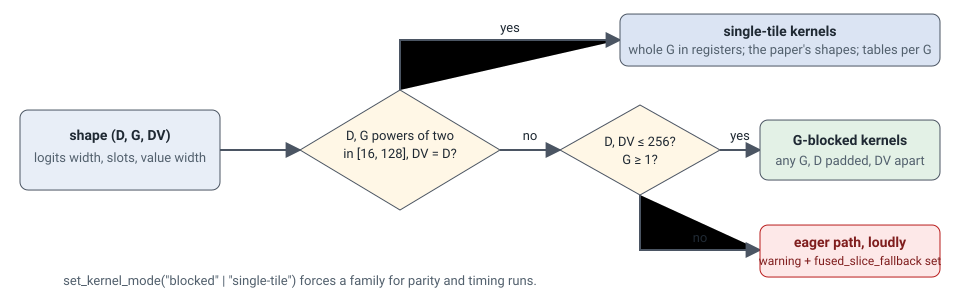

# Shapes and routing

<figure markdown>

</figure>

## Dimensions

| symbol | meaning | tensor |
| --- | --- | --- |
| `B`, `N`, `H` | batch, points, heads | `x_mid` `(B, N, H, D)` |
| `D` | logits width: what the membership is computed from | `x_mid`, `weight` |
| `DV` | value width: what is pooled and broadcast | `fx_mid`, `tokens`, `out` |
| `G` | slots (slices, tokens, anchors) | `weight` `(.., G, D)`, `bias` `(.., G)` |

`D` and `DV` are usually equal (Transolver: the head width). They differ when
the membership carries channels the values do not — positional encodings
next to content features, say — and then the blocked family serves the shape
without zero-padding the values.

## Routing rules

- **Single-tile** when `D` and `G` are powers of two in `[16, 128]` and
  `DV == D`. These kernels hold the whole slot axis in one tile; they are the
  tuned, measured path, and the tables are keyed by `G`.
- **Blocked** otherwise, for any `G >= 1` and `D`, `DV` in `[1, 256]`. `D` is
  padded to a power of two (`PAD_D` masks the loads); `G` is cut into blocks
  of `GB` with the last block masked (`PAD_G`); `DV` is padded independently
  (`PAD_V`). Only `D` or `DV` beyond 256 is refused: like FlashAttention, the
  head width is never blocked over.
- **Eager fallback**, loudly, when neither applies: the layer logs a warning,
  sets `use_fused_slice = False` on the built model and records the reason in
  `fused_slice_fallback`. A flag that is silently inert trains a baseline
  replica and looks like a result; this one cannot.

`unsupported_dims(D, G, DV)` returns the reason or `None`;
`single_tile_dims(D, G, DV)` says which family `auto` picks;
`set_kernel_mode("blocked" | "single-tile" | "auto")` forces a family for
parity and timing runs (`"single-tile"` raises on a shape it cannot serve
rather than switching).

## Weight layouts

| `weight` | `bias` | meaning |
| --- | --- | --- |
| `(G, D)` | `(G,)` or `None` | one slot projection shared by every head and sample (Transolver) |
| `(H, G, D)` | `(H, G)` | per head |
| `(B, H, G, D)` | `(B, H, G)` | per sample and head: the slots are keyed by something of the sample, e.g. `weight = k(tokens)` |

Every kernel reads the weight through batch and head strides that are zero
where the tensor is shared, so the layout costs nothing at launch; a
non-contiguous weight is copied once per call. `dW` and `db` are reduced per
program and then over whichever axis the parameter is shared along, and come
back in the parameter's shape and dtype, so a weight computed from a token
stream passes its gradient on.

## Tile tables

Both families carry hardcoded `(BLOCK_N, num_warps, num_stages)` tables from
sweeps on one GH200 at `N = 262k`:

- `slice_ops._CFG` / `_CFG_BF16`, keyed by `G` for the single-tile set, one
  entry per kernel and (input dtype, dot level).
- `blocked._CFG_BLK`, keyed by `(G_block, D_tile)` or
  `(G_block, D_tile, DV_tile)`; the key with the value width is looked up
  first. Where a key is missing the blocked kernels borrow the single-tile
  table for `G = G_block` (`blocked._FAMILY`), with `BLOCK_N` scaled by
  `32 / D_tile` — a heuristic, not a measurement.

The blocked kernels are far more tile-sensitive than the single-tile ones:
with borrowed tiles two of them ran 9–11× slower than their single-tile twins
at the same shape. **A new blocked shape deserves a sweep before its numbers
are trusted**: `bench/bench_kernels.py --family blocked` at the shape, then
`bench/pick_tiles.py` to print the table entry
([Tests and benchmarks](../benchmarks.md#tile-sweeps)).

The block size `GB` comes from `blocked.tiles(D, G)`: the largest of 16..64
that keeps `GB * D_tile <= 2048`, capped by `G` rounded up. `set_block_g`
overrides it.

## Statistics modes

The blocked kernels form the per-point statistics `(m, l)` of the softmax in
one online pass by default (`set_stats_mode("online")`); a deslice with no
statistics forms its output in that same pass. `"two-pass"` is the original
max-then-sum form, kept so that a difference can be attributed. Both are held
to the parity gate.

## Other GPUs

Nothing in the kernels is Hopper-specific — the `tf32` and `bf16` dot modes
need Ampere-class tensor cores or newer, the default `ieee` mode needs none —
but the tile tables were swept on Hopper's 227 KB of shared memory per block,
and entries with `num_stages=3` or `BLOCK_N=256` can exceed the 100 KB of an
Ada part such as the RTX 4090. That fails at compile time with a Triton
resource error, not silently; the fix is a sweep on the target GPU and new
table entries. Memory use does not depend on the GPU.

Two Triton 3.0 limits are built in and documented in the code: backward
kernels with tensor-core dots stay on 4 warps (an `mma -> mma` layout
conversion asserts on 8), and tf32 dots run single-stage (the loop pipeliner
segfaults on async tf32 dots). A newer Triton may lift both; the tables would
then deserve a fresh sweep.
