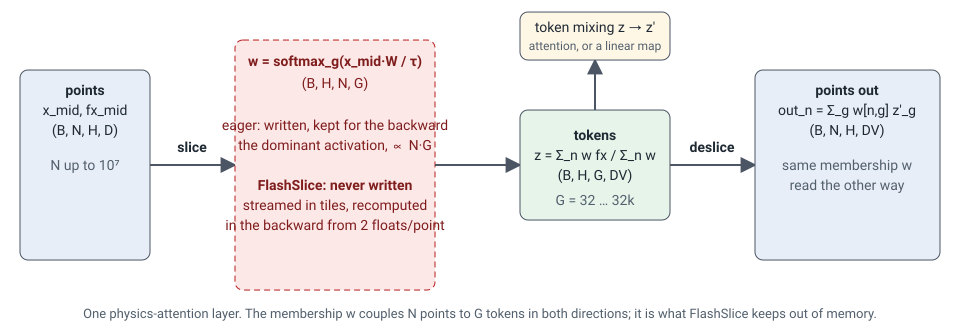

# FlashSlice

Fused Triton kernels for the slice/deslice bottleneck of physics-attention, and
the Transolver layer they accelerate.

FlashSlice is the companion code of **"Does Transolver Need a Transformer?"**.
The paper's claim is that Transolver's accuracy comes from alternating
full-resolution pointwise MLPs with a learned low-rank pooling/unpooling
bottleneck, the *slice* and *deslice*, and not from the self-attention among the
physics tokens in between. The kernels make that bottleneck cheap: the
membership tensor that couples every point to every token is never written to
memory, and the layer's memory stops growing with the token count.

<figure markdown>

</figure>

## What is here

- **Two kernel families** behind one pair of ops, `fused_slice` and
  `fused_deslice`. The single-tile kernels serve the paper's shapes and hold the
  whole slot axis in registers. The G-blocked kernels serve every other shape,
  any slot count, and stream the membership in blocks the way FlashAttention's
  backward does.
- **The Transolver layer and model**, instrumented with every ablation the paper
  reports, so `use_fused_slice=True` is an implementation switch and not a model
  change: outputs match the eager path and checkpoints interchange.
- **A parity gate**, not a tolerance: the fused path is held to eager fp32's own
  distance from an fp64 reference, on outputs and every gradient, and to
  bitwise determinism across runs.
- **Beyond the paper's shapes.** The slice weight may be shared, per head or per
  sample and head, with its gradient flowing on to whatever produced it; the
  logits width may differ from the value width; a tied coupling in either order
  pays for the membership once per op. These came from using the kernels as the
  coupling of a point-cloud model with thousands of sample-specific anchors.

## Where to go

| you want to | read |
| --- | --- |
| install and run the layer or the ops | [Getting started](getting-started.md) |
| understand why slice/deslice is the cost and how the kernels remove it | [The bottleneck](design/bottleneck.md), [The kernels](design/kernels.md) |
| know what precision you get and why the result is deterministic | [Numerics and determinism](design/numerics.md) |
| know which shapes run on which kernels and how to tune a new one | [Shapes and routing](design/shapes.md) |
| the function signatures and flags | [API reference](api.md) |
| the measured numbers | [Performance](performance.md) |
| run the tests, the parity gate and the sweeps | [Tests and benchmarks](benchmarks.md) |
| the paper's finding that motivates the kernel | [What the paper found](paper.md) |

## Status

Developed and measured on NVIDIA GH200 under torch 2.5 / Triton 3.0. Tag
`v0.1.0` is the tree the paper's numbers come from; `main` carries the
extensions listed in the [changelog](changelog.md). Apache-2.0.
